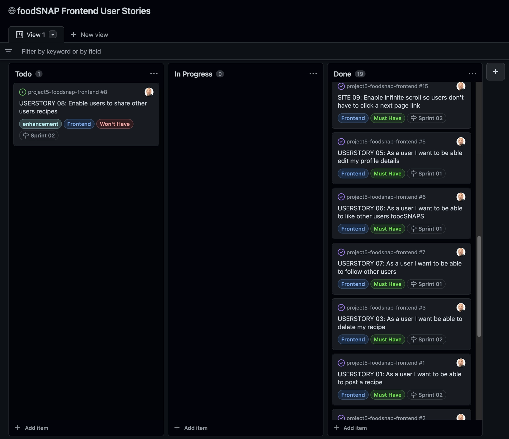
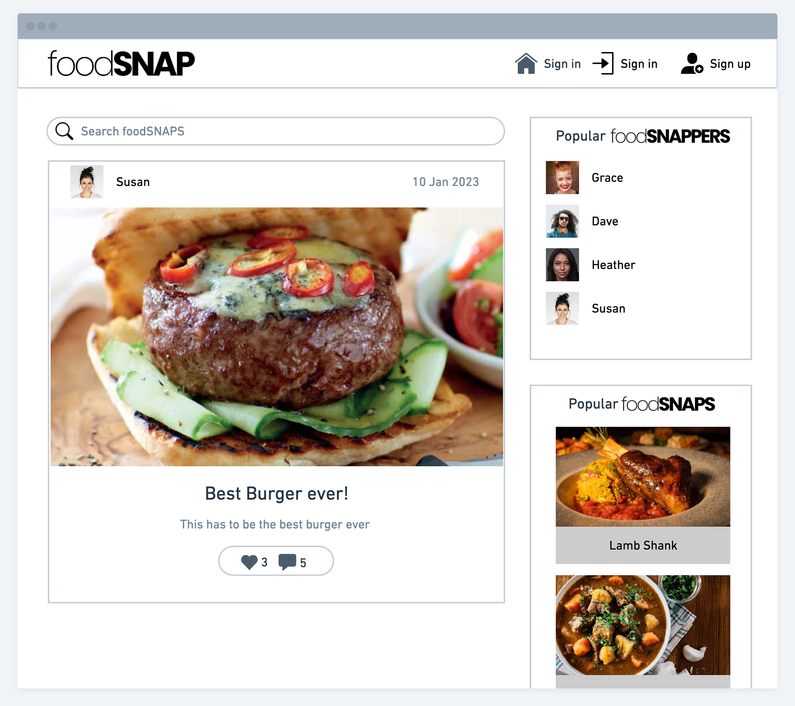
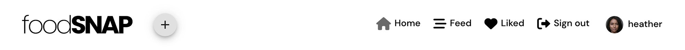
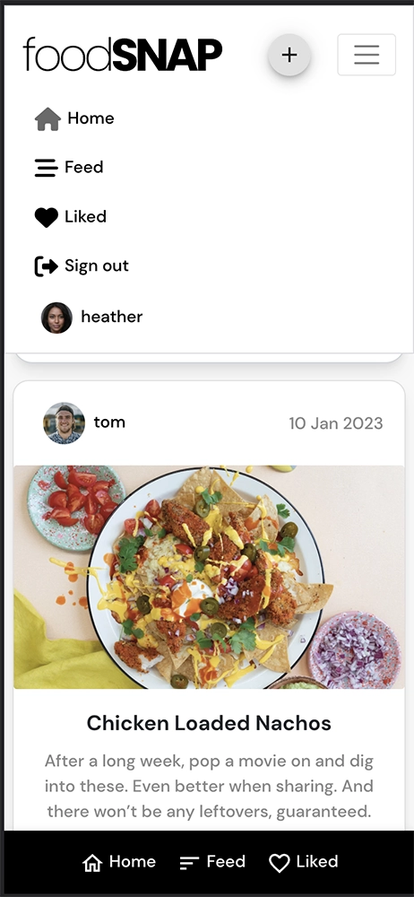
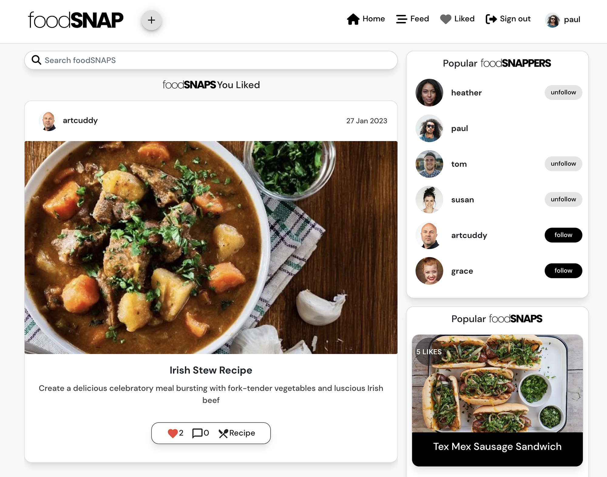

 

<h2>Upload your foodSnaps so your friends can comment & like your foodSNAPS. 
Follow other users & find great recipes to try out that they have uploaded to foodSNAP!</h2>

<h1 id="contents">Contents</h1>

-   [Introduction](#introduction)
-   [Live Site](#demo)
    -   [Backend API repository](#demo)
-   [User Experience - UX](#user-experience)
    -   [User Stories](#user-stories)
    -   [Agile Methodology](#agile-methodology)
    -   [The Scope](#the-scope)
-   [Design](#design)
    -   [Colours](#colours)
    -   [Typography](#typography)
    -   [Media](#media)
    -   [Wireframes](#wireframes)
-   [Features](#features)
    -   [Homepage](#homepage)
    -   [Navigation Desktop](#navigation-desktop)
    -   [Navigation Mobile](#navigation-mobile)
    -   [foodSNAP Details](#foodsnap-details)
    -   [foodSNAP Sidebar](#foodsnap-sidebar)
    -   [foodSNAP Feed](#feed)
    -   [Liked foodSNAPS](#liked-foodsnaps)
    -   [Search Results](#search-results)
    -   [foodSNAP Profile](#profile)
    -   [Future Features](#future-features)
-   [Technologies](#technologies)
    -   [Languages](#languages)
    -   [React Packages](#react-packages)
    -   [Frameworks & Libraries](#frameworks)
-   [Development](#development)
    -   [Custom Components](#custom-components)
    -   [Custom Hooks](#custom-hooks)
    -   [Contexts](#custom-contexts)
    -   [React Component Diagram](#component-diagram)
-   [Testing](TESTING.md)
    -   [Automated Jest Testing Results](#testing-results)
    -   [Manual Testing Results](#testing-results)
-   [Deployment](#deployment)
-   [Credits](#credits)

<h1 id="introduction">Introduction</h1>

Project Milestone 5 for Code Institute Full-stack development program. foodSNAP - is a frontend React.js project that runs on Heroku.

This app allows users to upload foodSNAPS then create, edit, add comments and add recipes from the frontend once registered & logged in.

<h1 id="demo">Live Site</h1>
A live version of the site can be found <a href="https://foodsnap-react.herokuapp.com/" target="_blank">HERE</a>  

This repository is the frontend for foodSNAP utilising React.js.

The backend API repository can be found <a href="https://github.com/artcuddy/project5-foodsnap-backend" target="_blank">HERE </a>  

  

<h1 id="user-experience">User Experience - UX</h1>

<a href="#top">Back to the top.</a>

<h2 id="user-stories">User Stories</h2>

-   As a non-authenticated website user, I can:

1. Navigate around the site and easily view the desired content.
2. View all foodSNAPS on the homepage.
3. Search foodSNAPS to find specific posts.
4. Click on foodSNAP to view the foodSNAP.
5. Register for an account to like & comment on a foodSNAP.
6. View the number of likes on a foodSNAP.
7. View comments on foodSNAPS so that I can read other users opinions.

-   As an authenticated website user, I can:

1. Create a new foodSNAP and upload an image.
2. Add a recipe to my foodSNAP so other users can make the dish.
3. Edit a foodSNAP change the image or update the details
4. Delete my foodSNAPS
5. Edit a recipe by updating the ingredients & method
6. Delete my recipes
7. Like/unlike foodSNAPS and view my liked foodSNAPS on a single liked foodSNAPS page.
8. Follow/unfollow other foodSNAPPERS and view my follwed foodSNAPPERS posts on a single feed page.
9. Comment on foodSNAPS and give my opinion about the image or recipe.
10. Delete or edit my previous comments.
11. Manage my profile by updating my details and profile image.

<h2 id="agile-methodology">Agile Methodology</h2>

The Agile Methodology was used to plan this project. This was implemented through Github and the Project Board which can be seen here - <a href="https://github.com/users/artcuddy/projects/4" target="_blank"> foodSNAPS React User Stories</a>

Through the use of the Kanban board in the projects view in Github, the project was divived into a few different sections:

-   Addons
-   Todo
-   In Progress
-   Done

Github issues were used to create User Stories and any other fixes or updates for the project. This was where the project user was assigned, labels were added to provide clarity, and the story was added to the appropriate sprint and the project. Each User Story, Fix or Update had a clear title.

Milestones were used to create sprints. There were 2 sprints each dated appropriately. User Stories were completed based on the current sprint in progress. Each sprint was completed on time.

1 enhancement feature was not completed and left as [Future Features](#future-features) for further development.

The Github issues were not just used to record User Stories but also used to record any bug fixes or updates to the codebase as well.

<h2 id="the-scope">The Scope</h2>

-   To provide users with a good clean experience when using the foodSNAP website.
-   To provide users with a visually pleasing website that is intuitive to use and easy to navigate.
-   To provide a website with a clear purpose.
-   To provide role-based permissions that allows user to interact with the website example: uplaod image, like, comment and add a recipe.
-   To provide search functionality to find recipes on the foodSNAP site.

<h1 id="design">Design</h1>

<a href="#top">Back to the top.</a>

<h2 id="colours">Colours</h2>

-   I decided to stick with the high contrast colour palette to maintain a nice visual contrast when viewing the site

-   Background: #f8f8f8

-   Headings: #000000

-   Subheadings: #8a8a8a

<h2 id="typography">Typography</h2>

-   Utilised the DM Sans font for the complete site to keep it clean and modern.

<h2 id="media">Media</h2>

-   All recipes are from<a href="https://www.bbcgoodfood.com/" target="_blank"> BBC Good Food</a>

-   All images are from<a href="https://unsplash.com/" target="_blank"> Unsplash </a>

-   The logo and favicon are designed by me in<a href="https://www.sketch.com" target="_blank"> Sketch </a>

<h2 id="wireframes">Wireframes</h2>

Initial Wireframes

<a href="#top">Back to the top.</a>

-   The wireframes were created using <a href="https://whimsical.com/">Whimsical</a>

-   Desktop

-   Mobile

<h1 id="features">Features</h1>

<a href="#top">Back to the top.</a>

<h2 id="homepage">Homepage</h2>

-   The Home Page is the landing page of the website and that's visible first when the site loads. It is designed to allow the user to quickly find their way around the site. The homepage displays all foodSNAPS in chronological order by lateset first and the sidebar displays the top followed foodSNAPPER's and below that the top liked foodSNAPS.

<h2 id="navigation-desktop">Navigation Desktop</h2>

<a href="#top">Back to the top.</a>

-   The site navigation is done through the navigation bar at the top of each page & this is consistant throughout the website.

-   The navigation bar at the top of each page is sticky to allow access to the navigation at any time.

-   Options on the navigation bar change depending on whether the user is logged in or not.

-   Navigation menu when nobody is logged in only options are home, login & sign-up.

    

-   Navigation menu when an authenticated user is logged in options are home, feed, liked, sign out & profile.

-   Users also have the + icon to add a new foodSNAP.

    

<h2 id="navigation-mobile">Navigation Mobile</h2>

<a href="#top">Back to the top.</a>

-   Navigation menu when nobody is logged in only menu options are home, login & sign-up.

-   There is also a sticky footer navigation on mobile with the only the home option.

-   Navigation menu when regular authenticated user is logged in options are home, feed, liked, sign out & profile.

-   There is also a sticky footer navigation on mobile with the home, feed & liked options.

<h2 id="foodsnap-details">foodSNAP Details</h2>

<a href="#top">Back to the top.</a>

-   When an authenticated user is logged in they can upload, create, edit, like, comment & add a recipe on the foodSNAP detail page.

-   A tooltip displays extra info to the user regarding the button functionaliity.

-   Create foodSNAP

-   Edit foodSNAP by clicking on the 3 dots icon on the details page.

-   Add foodSNAP recipe.

-   Recipe added.

-   Close Recipe once openend the icon changes to an X.

-   Add a comment

-   Edit a comment by clicking on the 3 dots icon.

<h2 id="foodsnap-sidebar">foodSNAP Sidebar</h2>

<a href="#top">Back to the top.</a>

-   The sidebar displays the top 6 followed foodSNAPPERS with 1 or more followers and below that the 4 top liked foodSNAPS with 2 or more likes.

-   You can also follow or unfollow a foodSNAPPER here.

-   Popular foodSNAPPERS

-   Below the top 6 followed foodSNAPPERS the sidebar displays the 4 top liked foodSNAPS with 2 or more likes in decending order.

-   Popular foodSNAPS

<h2 id="feed">Feed Followed foodSNAPPERS</h2>

<a href="#top">Back to the top.</a>

-   When an authenticated user follows a foodSNAPPER this will be added to their feed page which can be accessed by clicking on the feed icon on the navbar.

-   If the user has not followed anyone a message will appear to follow a user.

<h2 id="liked-foodsnaps">Liked foodSNAPS</h2>

<a href="#top">Back to the top.</a>

-   When an authenticated user likes a foodSNAP this will be added to their liked foodSNAPS page which can be accessed by clicking on the heart liked icon on the navbar.

-   If the user has not liked any foodSNAPS a message will appear to like a foodSNAP first.

<h2 id="search-results">Search Results</h2>

<a href="#top">Back to the top.</a>

-   Enter a search word in the search box and click enter the search results will be displayed filterd by the search word.

-   The search is performed on the foodSNAP title & the username fields.

-   Once you start typing a X appears on the right hand side and if clicked this clears the search bar.

<h2 id="profile">Profile</h2>

-   On the profile page the user can view all the foodSNAPS they have created.

-   This can be accessed by clicking on the profile image on the top right of the navbar.

-   The user can also see how many foodSNAPS they have liked and how many foodSNAPPERS they folllow.

-   If the user is the owner of the profile they can edit their profile by clicking on the 3 dots.

-   You can change the image and your bio here.

-   You can change your username here.

-   You can change your password here.

<a href="#top">Back to the top.</a>

<h2 id="future-features">Possible Future Features</h2>

<a href="#top">Back to the top.</a>

-   Social login to allow the user to signup using Facebook or Google.

-   Allow users to tag each other by username.

-   Allowing users to share their foodSNAPS with other foodSNAP users.
    <a href="https://github.com/artcuddy/project5-foodsnap-frontend/issues/8">Github Issue #8</a>

<h1 id="technologies">Technologies</h1>

<a href="#top">Back to the top.</a>

Throughout the planning, design, testing and deployment of the foodSNAP app, I have used a number of technologies listed below:

<h2 id="languages">Languages Used</h2>

-   [HTML 5](https://en.wikipedia.org/wiki/HTML/)
-   [CSS 3](https://en.wikipedia.org/wiki/CSS)
-   [JavaScript](https://www.javascript.com/)
-   [React](https://reactjs.org/)

<h2 id="react-packages">React Dependencies Used</h2>

-   [NPM](https://www.npmjs.com/package/node) 
    Package manager used to install dependencies
-   [React Bootstrap](https://react-bootstrap.github.io/) 
    Was used to style the website, add responsiveness and interactivity
-   [Axios](https://axios-http.com/docs/intro) 
    As the HTTP client for the app.
-   [Material UI](https://mui.com/) 
    Was used for certain components and icons.
-   [JWT Decode](https://www.npmjs.com/package/jwt-decode) 
    To help decoding JWTs token which are Base64Url encoded.
-   [Notistack](https://notistack.com/) 
    It allows notifications to be stacked on top of one another.
-   [react-infinite-scroll-component](https://www.npmjs.com/package/react-infinite-scroll-component) 
    A component to make the post load as an infinite scroll.
-   [Zustand](https://docs.pmnd.rs/zustand/getting-started/introduction) 
    A small, fast and scalable bearbones state-management solution.
-   [react-router-dom](https://www.npmjs.com/package/react-router-dom) 
    Bindings for using React Router in web applications.
-   [jest-dom](https://testing-library.com/docs/ecosystem-jest-dom/) 
    Testing Library that provides custom DOM element matchers for Jest.
-   [ESLint](https://eslint.org/) 
    ESLint was used to evaluate all the React.js code

<h2 id="frameworks">Frameworks - Libraries - Programs Used</h2>

-   [ElephantSQL](https://www.elephantsql.com/) 
    ElephantSQL is a PostgreSQL database hosting service were the database for foodSNAP was created
-   [Git](https://git-scm.com/) 
    Git was used for version control by utilizing the Gitpod terminal to commit to Git and push to GitHub
-   [GitHub](https://github.com/) 
    GitHub is used to store the project's code after being pushed from Git
-   [Heroku](https://id.heroku.com) 
    Heroku was used to deploy the live project
-   [VSCode](https://code.visualstudio.com/) 
    VSCode was used to create and edit the app
-   [Whimsical](https://whimsical.com/) 
    Whimsical was used to create the wireframes & flow chart
-   [W3C - HTML](https://validator.w3.org/) 
    W3C- HTML was used to validate all the HTML code
-   [W3C - CSS](https://jigsaw.w3.org/css-validator/) 
    W3C - CSS was used to validate the CSS code
-   [Fontawesome](https://fontawesome.com/) 
    To add icons to the app
-   [Google Chrome Dev Tools](https://developer.chrome.com/docs/devtools/) 
    To check App responsiveness and debugging
-   [Adobe Photoshop](https://www.adobe.com/ie/products/photoshop.html) 
    To convert the images to webp format
-   [Sketch](https://www.sketch.com/) 
    To build the logo and icon for the project
-   [Tables Generator](https://tablesgenerator.com/) 
    To build the tables in the readme.md file

<h1 id="development">Development</h1>

<a href="#top">Back to the top.</a>

<h2 id="component-diagram">React Component Diagram</h2>

<h2 id="custom-components">Custom Components</h2>

<a href="#top">Back to the top.</a>

Custom components were created to enable the code and functionality to re-used throughout the foodSNAP app

-   [PopularPosts.js](https://github.com/artcuddy/project5-foodsnap-frontend/blob/main/src/components/posts/PopularPosts.js) was created to display the 4 most liked posts in decending order by amount of likes and equal or more than 2 likes.

-   [PopularProfiles.js](https://github.com/artcuddy/project5-foodsnap-frontend/blob/main/src/components/profiles/PopularProfiles.js) was created to display the 6 most followed foodSNAPPERS in decending order by amount of followers and equal or more than 1 follower.

-   [ConfirmDialog.js](https://github.com/artcuddy/project5-foodsnap-frontend/blob/main/src/components/ConfirmDialog.js) was created to enable a popup modal to confirm the users action before content deletions.

-   [ScrollToTop.js](https://github.com/artcuddy/project5-foodsnap-frontend/blob/main/src/components/ScrollToTop.js) was created to scroll the user to the top of the page on navigation to a new page.

-   [AlertPopUp.js](https://github.com/artcuddy/project5-foodsnap-frontend/blob/main/src/components/AlertPopup.js) was created to enable toast messaging on user success and error actions.

-   [FloatingActionButton.js ](https://github.com/artcuddy/project5-foodsnap-frontend/blob/main/src/components/FloatingActionButton.js) was created to enable the + icon in the NavBar to allow a user to add a new foodSNAP and display a tooltip on desktop hover.

-   [FooterNavBar.js](https://github.com/artcuddy/project5-foodsnap-frontend/blob/main/src/components/FooterNavBar.js) was created to display a sticky footer on mobile with different icons depending on if the user is logged in or not.

-   [NavBar.js](https://github.com/artcuddy/project5-foodsnap-frontend/blob/main/src/components/NavBar.js) was created to display the navigation menu and display different icons depending on if the user is logged in or not.

-   [Asset.js](https://github.com/artcuddy/project5-foodsnap-frontend/blob/main/src/components/Asset.js) was created to display a spinner when data is being fetched to notify the user that an action is being performed.

-   [Avatar.js](https://github.com/artcuddy/project5-foodsnap-frontend/blob/main/src/components/Avatar.js) was created to display the users profile image throughout the app.

-   [NotFound.js](https://github.com/artcuddy/project5-foodsnap-frontend/blob/main/src/components/NotFound.js) was created to display a message to the user if the content they are looking for does not exist.

<h2 id="custom-hooks">Custom Hooks</h2>

-   [useAlert.js](https://github.com/artcuddy/project5-foodsnap-frontend/blob/main/src/hooks/useAlert.js) hook was created to call the alert messaging in the app

-   [useRedirect.js](https://github.com/artcuddy/project5-foodsnap-frontend/blob/main/src/hooks/useRedirect.js) was created to redirect the user to the homepage based on their userAuthStatus

-   [useClickOutsideToggle.js](https://github.com/artcuddy/project5-foodsnap-frontend/blob/main/src/hooks/useClickOutsideToggle.js) was created close the expanded menu on a click outside the menu at every stage in the app

<h2 id="custom-contexts">Custom Context</h2>

-   [AlertContext.js](https://github.com/artcuddy/project5-foodsnap-frontend/blob/main/src/contexts/AlertContext.js) was created to allow the alert functionality to be used at every stage in the app

-   [CurrentUserContext.js](https://github.com/artcuddy/project5-foodsnap-frontend/blob/main/src/contexts/CurrentUserContext.js) was created to get the current users authentication state and redirect the user to the signin page if not signed in.

-   [ProfileDataContext.js](https://github.com/artcuddy/project5-foodsnap-frontend/blob/main/src/contexts/ProfileDataContext.js) was created to setProfileData, handleFollow, handleUnfollow of user profiles and access this data throughout the app.

<h1 id="development">Testing</h1>

<a href="#top">Back to the top.</a>

<h2 id="testing-results">Automated Testing Results</h2>

-   Automated Jest Testing results [HERE](TESTING.md#automated-testing)

<h2 id="testing-results">Manual Testing Results</h2>

-   Manual Testing results [HERE](TESTING.md#manual-testing)

<h1 id="deployment">Deployment</h1>

<a href="#top">Back to the top.</a>

### This project was created on GitHub and edited in GitPod by carrying out the following:

<ol>
    <li>A new repository was created without a template</li>
    <li>A meaningful name was given to my new repository and I selected 'Create Repository'</li>
    <li>I then opened the repository on GitHub and clicked the 'Gitpod' button to build the GitPod workspace which would allow me to build and edit the code used to make the <em>foodSNAP</em> app.</li>
    <li>Version control was used throughout the project using the following commands in the terminal using Bash
        <ul>
            <li>git add . <strong>OR</strong> git add "file name" - to stage the changes and get them ready for being committed to the local repo.</li> 
            <li>git commit -m "Description of the update" - to save the change and commit the change to the local repo</li>
            <li>git push - to push all committed changes to the GitHub</li>
            <li>commit --amend - for changing the wording or spelling of the most recent commit</li>
            <li>git reset "commit hash" </li>
            <li>git push -f - This was used to force changes through to the GitHub repo if either "commit --amend" or "git reset" were used</li>
        </ul>
    </li>

## Heroku

The project was deployed via <a href="https://id.heroku.com/login" target="_blank">Heroku</a>, and the live link can be found here: <a href="https://foodsnap-react.herokuapp.com/" target="_blank">foodSNAP</a>

Some of the deployment steps below are specifically required for this project and may not be applicable to older versions, or different projects.

Before deploying to Heroku I created the Procfile with web: serve -s build

Created .slugignore with /documentation, README.md & TESTING.md as paths to ignore in Heroku as I don't want the documentation to upload to Heroku.

This project was deployed to Heroku using the Heroku CLI details below

-   Login
    To use the CLI you must log in to your Heroku account. To do this you will need to
    enter the command heroku login -i in the terminal. It requires the email and
    password you used to sign up. If you have enabled multi-factor authentication (a
    recommended security practice) then instead of your password you need an API key.
    To get the API key go to your account settings and scroll down to the section ‘API
    Key’. Click reveal and copy that, then paste it into the password prompt.

-   Creating A Heroku App
    Now that you are logged in, the first thing is to create a new app. Heroku creates a
    URL based on your app name, so it must be unique not only on your account, but
    across the whole site. You may need to try a few different names. To create an app
    use the following command, where myapp is the name of your app.

-   Here the app heroku-cli-example has been created with an output of the website
    URL. It also displays and sets the git remote repository which will be used to deploy.
    By default the region will be set to the US. If you would prefer a server based in the
    EU then you can specify the region with the flag EU

-   When you push code to Heroku it will look at the repository contents to decide how
    to build the project. One of the factors taken into consideration is the package file.
    With a React project the standard file is a package.json file, which will have the
    list of packages needed to run the project. If this file is present it will build the project
    using the React buildpack.

-   It is also possible to specify the buildpack manually. More information about
    buildpacks can be found in the documentation. To check the buildpack for the
    project you can enter heroku buildpacks in the terminal.

## Deployment Steps On Heroku.

-   In Heroku create a new app, give it a name and choose location.

-   In the deploy tab, go to 'deployment method', choose 'Github'

-   Search for the repository in Github that you want to connect and click on the connect button

-   In the 'manual deploy' section click on 'deploy branch'

-   The build log will run, when complete you will see a message saying 'build succeeded'

-   An 'Open App' button will appear, click this to take you to your deployed app.

-   You can enable automatic deploys in the 'deployment section' so each time you push your code to 'Github' your deployed app will be updated.

## Github Local Deployment

There are many ways to deploy the project locally on your own device. Forking, Cloning, GitHub Desktop and Zip Exctraction, the steps in these processes are outlined below:

### Forking the GitHub repo

If you want to make changes to the repo without affecting it, you can make a copy of it by 'Forking' it. This will make sure that the original repo remains unchanged.

<ol>
    <li>Log in to your GitHub account</li>
    <li>Navigate to the repository <a href="https://github.com/artcuddy/project5-foodsnap-frontend" target="_blank"><strong>HERE</strong></a></li>
    <li>Select the 'Fork' button in the top right corner of the page (under your account image)</li>
    <li>The repo has now been copied into your own repos and you can work on it in your chosen IDE</li>
    <li>If you have any suggestions to make regards to the code to make the site better, you can put in a pull request</li>
</ol>

### Cloning the repo with GitPod

<ol>
    <li>Log in to your GitHub account</li>
    <li>Navigate to the Repository <a href="https://github.com/artcuddy/project5-foodsnap-frontend" target="_blank"><strong>HERE</strong></a></li>
    <li>Select the 'Code' button above the file list on the right had side</li>
    <li>Ensure HTTPS is selected and click the clipboard on the right of the URL to copy it</li>
    <li>Open a new workspace in GitPod</li>
    <li>In the bash terminal type 'git clone [copy url here from step 4]'</li>
    <li>Press enter - the IDE will clone and download the repo</li>
</ol>

### Github Desktop

<ol>
    <li>Log in to your GitHub account</li>
    <li>Navigate to the Repository <a href="https://github.com/artcuddy/project5-foodsnap-frontend" target="_blank"><strong>HERE</strong></a></li>
    <li>Select the 'Code' button above the file list on the right had side</li>
    <li>Select 'Open with GitHub Desktop'</li>
    <li>If you haven't already installed GitHub desktop application - you will need to follow the relevant steps to do this</li>
    <li>The repo will then be copied locally onto your machine</li>
</ol>

### Download and extract the zip directly from GitHub

<ol>
    <li>Log in to your GitHub account</li>
    <li>Navigate to the Repository <a href="https://github.com/artcuddy/project5-foodsnap-frontend" target="_blank"><strong>HERE</strong></a></li>
    <li>Select the 'Code' button above the file list on the right had side</li>
    <li>Select 'Download Zip'</li>
    <li>Once you have the Zip downloaded, open it with your prefered file decompression software</li>
    <li>You can then drag and drop the files from the folder into your chosen IDE or view/edit them on your local machine</li>
    <li>If you want to create a web-app from the repo please follow the instructions in "Project Deployment"</li>
</ol>

<h1 id="credits">Credits</h1>

<a href="#top">Back to the top.</a>

### I have listed some of the resources I used for inspiration and in researching how to create the foodSNAP app.

-   Code Institute "Moments" tutorial helped me setup the initial code for foodSNAP.

-   All the foodSNAP receipes are from <a href="https://www.bbcgoodfood.com/" target="_blank"><strong>BBC Good Food</strong></a>

-   All the header images are from <a href="https://unsplash.com/" target="_blank"><strong>Unsplash</strong></a>

### These are some of the resources that helped me solve some of the issues encountered when developing the site and also provided some inspiration

-   [W3Schools - React](https://www.w3schools.com/react/default.asp)
-   [Stack Overflow](https://stackoverflow.com/) for various code snippets and solutions
-   [React Documentation](https://reactjs.org/)
-   [React Testing Jest](https://jestjs.io/docs/tutorial-react)
-   [React Testing Jest Cheatsheet](https://devhints.io/jest)
-   [React Social Media Site](https://www.youtube.com/watch?v=zM93yZ_8SvE)
-   [React Social Media App Design](https://www.youtube.com/watch?v=FweHcYHkt9A)
-   [Material UI](https://mui.com/)
-   [Material UI Reusable Confirmation Dialog](https://dev.to/uguremirmustafa/material-ui-reusable-confirmation-dialog-in-react-2jnl)
-   [React Scroll Restoration](https://v5.reactrouter.com/web/guides/scroll-restoration)
-   [Scroll to top on route change](https://www.kindacode.com/article/react-router-dom-scroll-to-top-on-route-change/)

<h2 id="acknowledgements">Acknowledgements</h2>

<a href="#top">Back to the top.</a>

This project was made possible due to the help & advice from my Code Institute mentor Rohit, Code Institute Slack community, Stack Overflow community, my wife and family and a lot of extensive Googling.
