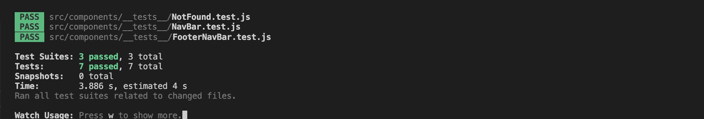

<h1 id="contents">foodSNAP Frontend Testing</h1>

Back to the [README](README.md)

The backend API testing repository can be found <a href="https://github.com/artcuddy/project5-foodsnap-backend/blob/main/TESTING.md" target="_blank">**HERE**</a><br>

<h1 id="contents">Contents</h1>

-   [Introduction](#introduction)
-   [Manual Testing](#manual-testing)
-   [Automated Testing](#automated-testing)
-   [Messaging / Alerts](#messaging)
-   [ESlint Validator](#eslint-validation)
-   [HTML Validator](#html-validation)
-   [CSS Validator](#css-validation)
-   [Console Results](#console-results)
-   [Lighthouse Results](#lighthouse)
    -   [Desktop](#lighthouse-desktop)
    -   [Mobile](#lighthouse-mobile)
-   [Bugs / Issues](#bugs)

<h1 id="introduction">Introduction</h1>

Project Milestone 5 for Code Institute Full-stack development program. foodSNAP - all testing results and code validation are listed below.<br>
Testing has taken place continuously throughout the development of the project. The app was tested regularly and deployed early to Heroku to confirm local and remote functioned the same.

<h1 id="manual-testing">Manual Functional Testing Results</h1>

<a href="#top">Back to the top</a>


<br/>
The online version of the Manual Functional Test Case can be found here <a href="https://docs.google.com/spreadsheets/d/1httv3Y2IJjzV_sj7WBncre5ICvjTv1ODlphDvt8Yrj8/edit#gid=0" target="_blank">**HERE**</a><br>

<br/>
<h1 id="automated-testing">Automated Jest Testing Results</h1>

Jest was setup for testing by adding the below code to the setupTests.js file to utilise the mocks/handlers.js file to simulate a user logging in and out.
It also starts the simulated browser and shuts it down after each test is run.
The handlers.js creates a user object and accesses the base url and dj-rest-auth/logout/ to test user authentication.

```
import "@testing-library/jest-dom";
import { setupServer } from "msw/node";
import { handlers } from "./mocks/handlers";

const server = setupServer(...handlers);

beforeAll(() => server.listen());
afterEach(() => server.resetHandlers());
afterAll(() => server.close());
```

Created 7 tests utilising the Jest testing suite

3 NavBar tests to see if the correct navigation links are shown to a logged in user versus a logged out user in the header.

```
test("renders NavBar", () => {
  render(
    <Router>
      <NavBar />
    </Router>
  );

  // screen.debug();
  const signInLink = screen.getByRole("link", { name: "Sign in" });
  expect(signInLink).toBeInTheDocument();
});

test("renders link to the user profile for a logged in user", async () => {
  render(
    <Router>
      <CurrentUserProvider>
        <NavBar />
      </CurrentUserProvider>
    </Router>
  );

  const profileAvatar = await screen.findByText("paul");
  expect(profileAvatar).toBeInTheDocument();
});

test("renders Sign in and Sign up buttons again on log out", async () => {
  render(
    <Router>
      <CurrentUserProvider>
        <NavBar />
      </CurrentUserProvider>
    </Router>
  );

  const signOutLink = await screen.findByText("Sign out", { name: "Sign out" });
  fireEvent.click(signOutLink);

  const signInLink = await screen.findByText("Sign in", { name: "Sign in" });
  const signUpLink = await screen.findByText("Sign up", { name: "Sign up" });

  expect(signInLink).toBeInTheDocument();
  expect(signUpLink).toBeInTheDocument();
});
```

3 FooterNavBar tests to see if the correct navigation links are shown to a logged in user versus a logged out user in the footer.

```
test("renders NavBar", () => {
  render(
    <Router>
      <NavBar />
    </Router>
  );

  // screen.debug();
  const signInLink = screen.getByRole("link", { name: "Sign in" });
  expect(signInLink).toBeInTheDocument();
});

test("renders links to the Homepage, users feed page and users liked page for a logged in user", async () => {
  render(
    <Router>
      <CurrentUserProvider>
        <FooterNavBar />
      </CurrentUserProvider>
    </Router>
  );

  const homeLink = await screen.findByText("Home");
  const feedLink = await screen.findByText("Feed");
  const likedLink = await screen.findByText("Liked");
  expect(homeLink).toBeInTheDocument();
  expect(feedLink).toBeInTheDocument();
  expect(likedLink).toBeInTheDocument();
});

test("renders Home icon link on log out", async () => {
  render(
    <Router>
      <CurrentUserProvider>
        <NavBar />
        <FooterNavBar />
      </CurrentUserProvider>
    </Router>
  );

  const signOutLink = await screen.findByText("Sign out", {
    name: "Sign out",
  });
  fireEvent.click(signOutLink);

  const homeLink = await screen.getByLabelText("Click to view liked page", {
    wname: "Home",
  });

  expect(homeLink).toBeInTheDocument();
});
```

1 NotFound test to see if the not found message is shown when no results can be found

```
import { render, screen, waitFor } from "@testing-library/react";
import { BrowserRouter as Router } from "react-router-dom";
import NotFound from "../NotFound";

test("renders notfound message", async () => {
  render(
    <Router>
      <NotFound />
    </Router>
  );

  const notFoundMessage = screen.getByText("Sorry, the page", { exact: false });
  await waitFor(() => {
    expect(notFoundMessage).toBeInTheDocument();
  });
});
```

-   All tests passed



<br />

<h1 id="messaging">Messaging / Alerts</h1>

<a href="#top">Back to the top</a>

<h2>Authentication</h2>

-   On the sign in page if a user submits a password that does not meet the requirments a warning alert will be displayed explaining the reason it failed.


-   On the sign up page if a user submits a password that does not meet the requirments a warning alert will be displayed explaining the reason it failed.


-   Logged in success alert with username top left of the screen.


-   Logged out success alert top left of the screen.


<h2>foodSNAPS</h2>

-   foodSNAP created success alert top left of the screen.


-   foodSNAP edited success alert top left of the screen.


-   When the delete foodSNAP icon is clicked a confirmation modal pops up to confirm the action to prevent accidental deletions.


-   Once the action is confirmed foodSNAP deleted success alert top left of the screen and foodSNAP is deleted.


<h2>Comments</h2>

-   Comment created success alert top left of the screen.


-   Comment edited success alert top left of the screen.


-   When the deletecomment icon is clicked a confirmation modal pops up to confirm the action to prevent accidental deletions.


-   Once the action is confirmed comment deleted success alert top left of the screen and comment is deleted.


<h2>Likes</h2>

-   foodSNAP liked success alert top left of the screen.


-   foodSNAP unliked success alert top left of the screen.


<h1 id="eslint-validation">ESLint Validation</h1>

<a href="#top">Back to the top</a>

All validation fixes recommended by ESLint were fixed and the follwing rules added to the .eslintrc.json configuration file.
The code now validates with ESLint

```
 "rules": {
    "react/react-in-jsx-scope": "off",
    "react/prop-types": "off",
    "no-unused-vars": ["warn", { "argsIgnorePattern": "req|res|next|__" }],
    "allowEmptyCatch": 0,
    "no-undef": "off",
    "react/display-name": "off"
    }
```

<h1 id="html-validation">HTML Validation</h1>


<h1 id="css-validation">CSS Validation</h1>


-   Custom CSS was validated using W3C Jigsaw validation service. Warings were displayed however,
    this is related to React Bootstrap 5 which will not affect the CSS performance.

<h1 id="console-results">Console Results</h1>

<a href="#top">Back to the top</a>

<h2 id="console-loggedout">Logged Out</h2>


-   The browser console shows 3 errors related to authentication as is expected as the user is not logged in.

<h2 id="console-loggedin">Logged In</h2>


-   The browser console is clean, no errors are displayed.

<h1 id="lightHouse">Lighthouse</h1>

Lighthouse was used to test Performance, Best Practices, Accessibility and SEO on Desktop and Mobile.

<h2 id="lighthouse-desktop">Desktop</h2>


<h2 id="lighthouse-mobile">Mobile</h2>


<h1 id="bugs">Bugs / Issues</h1>

<a href="#top">Back to the top</a>

The following bugs where found and fixed during the development process no further bugs have been discovered to date.

BUG: When a user navigates to a new page the page scroll depth stays the same user is not scrolled to the top of the new page
<br />
<a href="https://github.com/artcuddy/project5-foodsnap-frontend/issues/16">Github Issue #16</a>

-   Found a solution here https://v5.reactrouter.com/web/guides/scroll-restoration and implemented this tested and scroll to top on navigation works fine when going forward but also scroll to top on navigating backward

BUG: When a user navigates back to the previous page the page scrolls to the top with ScrollToTop enabled.
<br />
<a href="https://github.com/artcuddy/project5-foodsnap-frontend/issues/17">Github Issue #17</a>

-   Found a solution here https://www.kindacode.com/article/react-router-dom-scroll-to-top-on-route-change/ to stop the scroll to top happening on back navigation using POP

BUG: The post page refreshes 3 times when a user likes a post.
<br />
<a href="https://github.com/artcuddy/project5-foodsnap-frontend/issues/18">Github Issue #18</a>

-   I had accidentally added an alert to a useEffect statement which caused the page to refresh on post like, removed this to sort the issue

Back to the [README](README.md)
